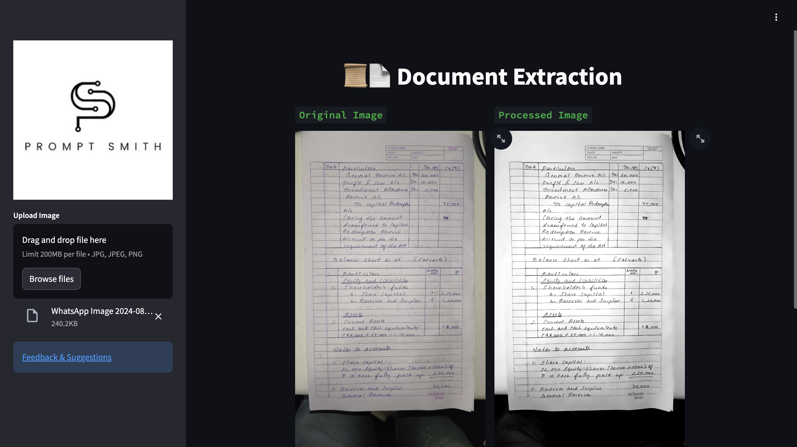

<center><h1>Document Extraction</h1></center>

<p align="center">
  
  
  
  
  
</p> 


---
**grayscale contrast**


**enhance color contrast**


**enhance color contrast and black & white**


## ⚙️Tech-Stack
- **Python**
- **OpenCV**
- **Streamlit**
- **Numpy**
- **Pandas**

## 🧤Image Preprocessing Steps

### Purpose
The `enhance_color_contrast` function is designed to preprocess an image by enhancing its color and contrast to make text more visible while reducing the effects of bleed-through. After these enhancements, the image is converted to grayscale and its brightness is adjusted to achieve a clearer, more readable result.

### Function Signature
```python
def enhance_color_contrast(uploaded_image):
```

### Parameters
- **`uploaded_image`**: 
  - **Type**: File-like object (e.g., an uploaded image file)
  - **Description**: The image file provided by the user. It should be in a standard image format such as JPEG, PNG, etc.

### Returns
- **`brightened_image`**:
  - **Type**: PIL Image object
  - **Description**: A grayscale version of the processed image with enhanced brightness, making text more visible and reducing bleed-through.

### Step-by-Step Processing

1. **Read the Image**
   ```python
   file_bytes = np.asarray(bytearray(uploaded_image.read()), dtype=np.uint8)
   image = cv2.imdecode(file_bytes, cv2.IMREAD_COLOR)
   ```
   - **Description**: Converts the uploaded image file into a NumPy array and decodes it into an OpenCV-compatible BGR format image.

2. **Check Image Validity**
   ```python
   if image is None:
       raise ValueError("Error: Unable to read the image. Please upload a valid image file.")
   ```
   - **Description**: Ensures the image was loaded correctly. If the image cannot be read, an error is raised.

3. **Convert Image to PIL Format**
   ```python
   pil_image = Image.fromarray(cv2.cvtColor(image, cv2.COLOR_BGR2RGB))
   ```
   - **Description**: Converts the image from OpenCV's BGR format to RGB format and then to a PIL Image object for easier manipulation.

4. **Enhance Contrast**
   ```python
   contrast_enhancer = ImageEnhance.Contrast(pil_image)
   pil_image = contrast_enhancer.enhance(1.5)
   ```
   - **Description**: Increases the contrast of the image by a factor of 1.5. This step helps make the text stand out more against the background.

5. **Enhance Color Saturation**
   ```python
   color_enhancer = ImageEnhance.Color(pil_image)
   pil_image = color_enhancer.enhance(1.5)
   ```
   - **Description**: Enhances the color saturation by a factor of 1.5, making the colors more vivid and improving text visibility.

6. **Convert Back to OpenCV Format**
   ```python
   enhanced_image = cv2.cvtColor(np.array(pil_image), cv2.COLOR_RGB2BGR)
   ```
   - **Description**: Converts the enhanced image back to OpenCV's BGR format for further processing.

7. **Optional: Apply Mild Denoising**
   ```python
   denoised_image = cv2.fastNlMeansDenoisingColored(enhanced_image, None, 10, 10, 7, 21)
   ```
   - **Description**: Applies mild denoising to reduce any noise in the image, which might have been enhanced along with the contrast and saturation. This step is optional.

8. **Convert Back to PIL Format**
   ```python
   final_pil_image = Image.fromarray(denoised_image)
   ```
   - **Description**: Converts the denoised image back to a PIL Image object for final processing.

9. **Convert to Grayscale**
   ```python
   grayscale_image = final_pil_image.convert('L')
   ```
   - **Description**: Converts the image to grayscale (luminance mode), removing color information while retaining the intensity.

10. **Adjust Brightness**
    ```python
    brightness_enhancer = ImageEnhance.Brightness(grayscale_image)
    brightened_image = brightness_enhancer.enhance(1.2)
    ```
    - **Description**: Increases the brightness of the grayscale image by a factor of 1.2. This adjustment helps make the image appear lighter and improves text readability.

11. **Return the Final Image**
    ```python
    return brightened_image
    ```
    - **Description**: Returns the final processed image, which is now in grayscale with enhanced brightness.

### Example Usage
```python
# Assuming 'uploaded_file' is an image file object obtained from a file upload
processed_image = enhance_color_contrast(uploaded_file)
processed_image.show()  # Displays the processed grayscale image with enhanced brightness
```

### Notes
- **Adjustable Parameters**: The contrast, saturation, and brightness enhancement factors can be adjusted to better suit the specific characteristics of the image. The default factors are set to `1.5` for contrast and saturation, and `1.2` for brightness.
- **Denoising**: The denoising step is optional and can be customized or skipped if the image is already clean or if noise reduction is not necessary.

This function is particularly useful for preprocessing scanned documents, making text clearer and reducing the visibility of any bleed-through from the reverse side of the page.